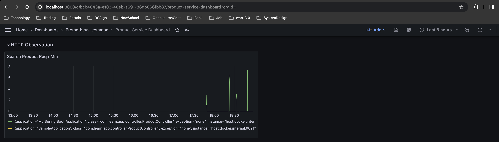

## monitoring-metrics-prometheus-grafana

This application illustrate the step-by-step procedure to integrate metrics in application

Application uses below dependencies
#### 1. Prometheus
#### 2. Grafana ( Dashboard UI )
#### 3. Spring Boot Application

We are using ```docker-composer``` to start the dependent applications for this demo.
- Docker composer helps to start ```Prometheus``` and ```Grafana``` in docker
```shell
docker compse up -d
```
### 1. Prometheus

- Prometheus works as data collector from application and saves the data in time series db
- It periodically hits application metrics url and collect the data

### 2. Grafana
- It uses prometheus as datasource and shows the data in graphical representation
- We use a sample dashboard(.json), which get loads at the time of grafana initialization

### 3. Application (SpringBoot)
- Start application in local system
```shell
mvn clean install -U
mvn spring-boot:run
```

## How to test

1. Start all applications as per above instruction 
2. Execute curl ```curl 'http://localhost:9091/product/v1/search/100'``` to release metrics data (count of api call) 
3. After sometime check grafana dashboard ```http://localhost:3000``` (user: admin, password: grafana)
4. You must get below dashboard.

